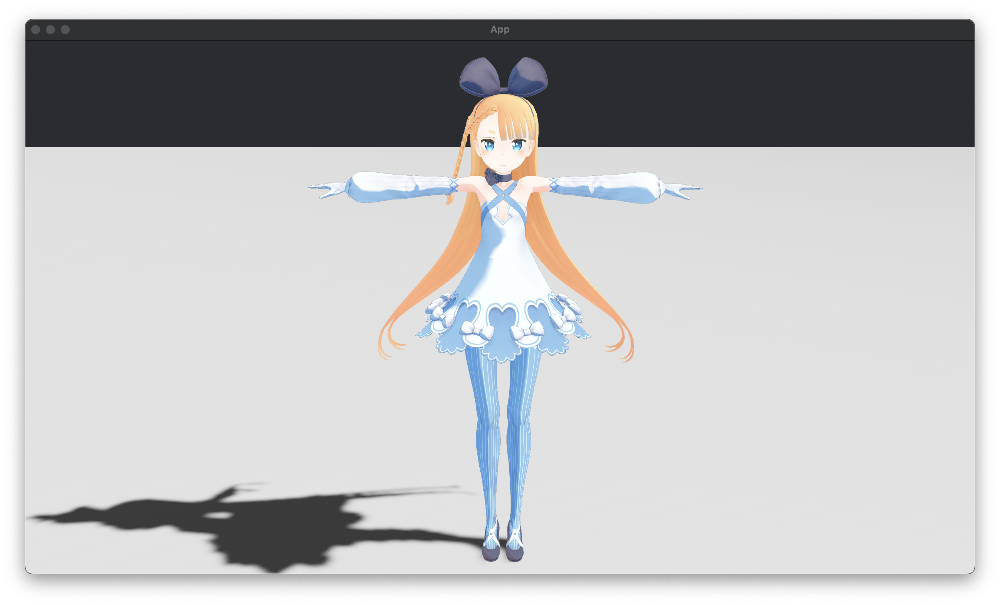
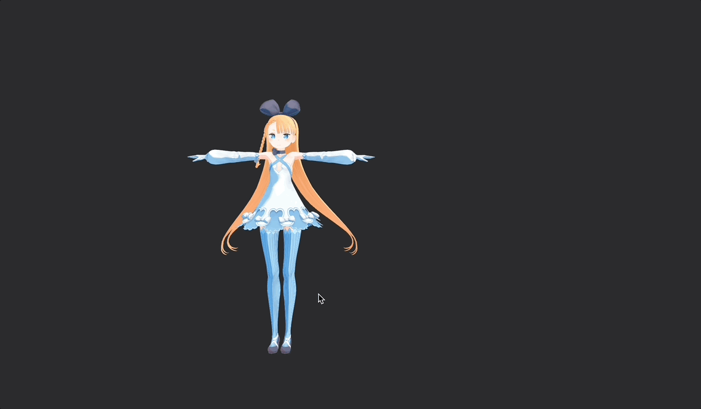
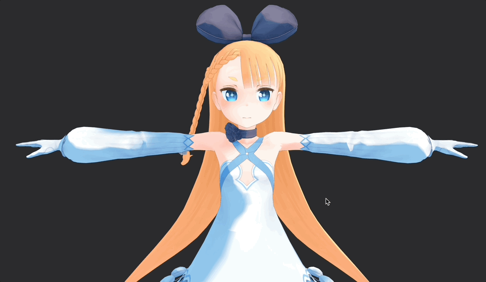

# bevy_vrm1

> [!CAUTION]
> This crate is in an early stage of development and may undergo breaking changes.

This crate allows you to use [VRM](https://vrm.dev/en/vrm/vrm_about/) and [VRMA](https://vrm.dev/en/vrma/).

## Features

| Feature        | currently supported |
|----------------|---------------------|
| Spring Bone    | ✅                   |
| Look At        | ✅                   |
| Animation(vrma) | ✅                   |
| First Person   | ❌                   |

### Spring Bone

This is a feature for expressing the sway of a character's hair and other parts.

- [spring bone specification(en)](https://github.com/vrm-c/vrm-specification/blob/master/specification/VRMC_springBone-1.0/README.md)
- [spring bone specification(ja)](https://github.com/vrm-c/vrm-specification/blob/master/specification/VRMC_springBone-1.0/README.ja.md)

#### examples
- [spring_bone.rs](./examples/spring_bone.rs)

### Look At

- [look at specification(en)](https://github.com/vrm-c/vrm-specification/blob/master/specification/VRMC_vrm-1.0/lookAt.md)
- [look at specification(ja)](https://github.com/vrm-c/vrm-specification/blob/master/specification/VRMC_vrm-1.0/lookAt.ja.md)

LookAt is a component for animating the line of sight into a VRM model.
You can use the `LookAt` component to track a specific target or the mouse cursor.

#### examples
- [look_at_cursor.rs](./examples/look_at_cursor.rs)
- [look_at_target.rs](./examples/look_at_target.rs)

### Animation(vrma)

## Credits

Using [bevy_game_template](https://github.com/NiklasEi/bevy_game_template) to CI.

### Sample Models

- **AvatarSample-A** by **pixiv Inc.'s VRoid Project**
- **AliciaSolid** by **©dwango, inc**

## Contact

- **Discord:** `@not_not_elm`